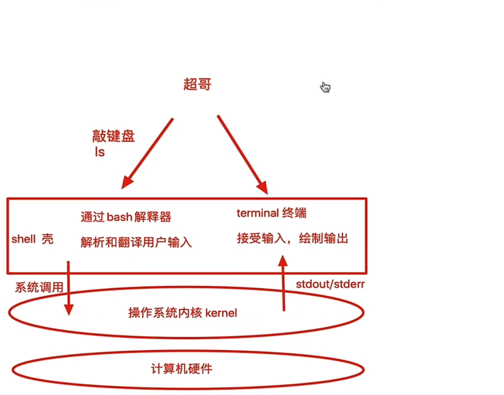
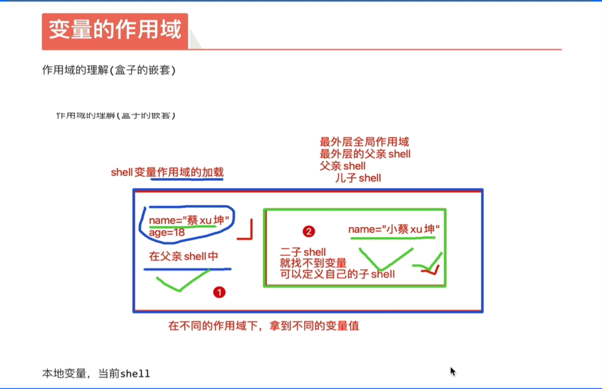
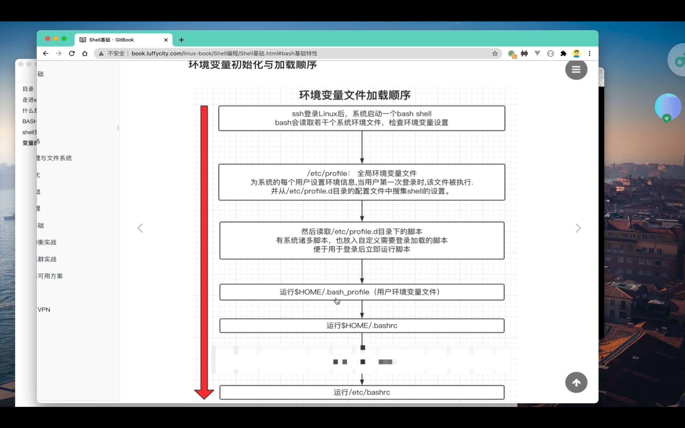

# 一、`shell`的概念


1. `shell`的作用：
	- 解释用户输入的命令或程序等
	- 用户输入一条命令，`shell`就解释一条
	- 键盘输入命令，`linux`给与响应的方式，称为交互式
2. `linux`结构图：
	
3. 说明：

	a. 从登录`linux`，输入帐号密码到进入`linux`交互界面，所有的操作，都是交给`shell`解释器执行的，流程如下图
	
4. 图形代与命令行操作的区别：
	- 命令行操作，`shell`解释执行后，输出结果到黑屏命令界面
	- 图形代操作，`shell`接受点击动作，输出界面数据

# 二、`shebang`


## （一）、`shebang`介绍

1. 当命令或者程序语句写在文件中，我们执行文件，读取其中的代码，这个程序文件就称为shell脚本
2. 在shell脚本里定义多条linux命令以及循环控制语句，然后将这此linux命令一次性执行完毕，执行脚本文件的方式称之为，非交互式方式
	- `windows`存在`*.bat`批量处理脚本
	- `linux`中常用`*.sh`脚本文件
3. 在`linux`系统中，`shell`脚本或者称之为（`bash shell`程序）通常都是`vim`编辑，由`linux`命令、`bash shell`指令、逻辑控制语句和注释信息组成

## （二）、`shebang`

1. 计算机程序中，`shebang`指的是出现在文本文件的第一行前两个字符`#!`
2. 在`unix`系统中，程序会分析`shebang`后面内容，作为解释器的指令，例如
	- 以`#!/bin/sh `开头的文件，程序在执行的时候会调用`/bin/sh`，也就是`bash`解释器
	- 以`#!/usr/bin/python` 开头的文件，代表指定`python`解释器去执行
	- 以`#!/usr/bin/env` 解释器名称，中一种在不同平台上都能正确找到解释器的办法，`env`查看环境变量
3. 注意事项：
	- 如果脚本未指定`shebang`，脚本执行的时候，默认用当前`shell`去解释脚本，即`$SHELL`
	- 如果`shebang`指定了可执行的解释器，如`/bin/bash` `/usr/bin/python`，脚本在执行时，文件名会作为参数传递给解释器
	- 如果`#!`指定的解释程序没有可执行权限，则会报错`“bad interpreter: Permission denied”`
	- 如果`#!`指定的解释程序不是一个可执行文件，那么指定的解释器会被忽略，转而交给当前的`SHELL`去执行这个脚本
	- 如果`#!`指定的解释程序不存在，那么会报错`“bad interpreter: No such file or directory ”`
	- `#!`之后的解释程序，需要写其绝对路径（如: `#!/bin/bash`），它是不会自动到`$PATH`中寻找解释器的
	- 如果使用`“bash test.sh”`这样的命令来执行脚本，那么#!这一行将会被忽略掉，解释器当然是用命令行中显示指定的`bash`
	
	<<<<<<<待补一张思维导图图片>>>>>>>

# 三、浅谈运维与编程语言


## （一）、 第四节 浅谈运维和编程语言

1. 脚本注释，脚本开发规范
	- 在`shell`脚本中，`#`后面的内容代表注释的内容，提供给开发者或使用者观看，系统会忽略此行
	- 注释可以单独写一行，也可以跟在命令后面
	- 尽量保持爱写注释的习惯，便于以后回顾代码的含义，尽量使用英文，而非中文
## （二）、执行`shell`脚本方式

1. `bash script.sh` 或 `sh script.sh` ，文件本身没权限执行，没`x`（运行）权限，则使用的方法，或脚本未指定`shebang`，重点推荐的方式
2. 使用 绝对/相对 路径执行脚本，需要文件含有`x`权限
3. `source script.sh` 或者 `. script.sh`，代表 执行含义，`source`等于`.`
4. 少见的用法，`sh < script.sh`
## （三）、不同的执行方式，不同的`shell`环境

1. 每次调用`bash/sh`解释器执行脚本，都会开启一个子`shell`，因此不保留当前的`shell`变量
	每次调用`bash/sh`解释器执行脚本，都会开启一个子`shell`，因此不保留当前的`shell`变量
2. 调用`source`或者点符号，是在当前`shell`环境加载脚本，因此保留变量
3.  作用域图

	


## （三）、`shell`与运维

1. `shell`脚本语言很适合处理纯文本类型数据，且`linux`的哲学思想就是一切皆文件，如日志、配置文件、文本、网页文件，大多数都是纯文本类型的，因此`shell`可以方便的进行文本处理，好比强大的`linux`三剑客（`grep`、`sed`、`awk`）
## （四）、脚本语言

1. `shell`脚本语言属于一种弱类型语言 无需声明变量类型，直接定义使用
	- 强类型语言，必须先定义变量类型，确定数字、字符串等，之后再赋予同类型的值
2. `centos7`系统中支持的`shell`情况，有如下种类
3. 默认的`sh`解释器
4. `shell`语言定义的变量，数据类型默认都是字符串类型
## （五）、其他脚本语言

1. `PHP`是网页程序语言，专注于`Web`网页开发，诸多开源产品，`wordpress`、`discuz`开源产品都是`PHP`开发
2. `Perl`语言，擅长支持强大的正则表达式，以及运维工具的开发
3. `Python`语言，明星语言，不仅适用于脚本程序开发，也擅长`Web`网页开发，如（系统后台、资产管理平台），爬虫程序开发，大量`linux`运维工具也由`python`开发，甚至于游戏开发也使用
## （六）、`shell`的优势

1. 虽然有许多脚本编程语言，但是对于`linux`操作系统内部应用而言，`shell`是最好的的工具，`linux`底层命令都支持`shell`语句，以及结合三剑客（`grep`、`sed`、`awk`）进行高级用法
	- 擅长系统管理脚本开发，如软件启停脚本、监控报警脚本、日志分析脚本
2. 每个语言都有自己擅长的地方，扬长避短，达到高效运维的目的是最合适的。

# 四、`bash`


## （一）、`bash`介绍

1. 介绍：
	- `bash`是一个命令处理器，运行在文本窗口中，并能执行用户直接输入的命令
	- `bash`还能从文件中读取`linux`命令，称之为脚本
	- `bash`支持通配符、管道、命令替换、条件判断等逻辑控制语句
2. `bash`有诸多方便的功能有助于运维人员提升工作效率
3. 查看存储历史记录数目大小指令
		```bash
	        	   echo $HISTSIZE
	       ```
	- 另一种查看历史记录的方式
		```bash
		       vim ~/.bash_history
		```
	- 存放用户执行的历史命令，写入文件
		```bash
	           echo $HISTFILE
		```
	- 相关的命令
		```bash
		           #history命令
		           -c 清空历史，但文件内容还是存在的
		           -r 恢复历史
		           #调用历史记录命令
		           !+历史ID、快速执行历史命令
		           !! 执行上一次的命令以及上下左右寻找
		```
## （二）、`bash`特性汇总

1. 常用汇总
	- 文件路径`tab`键补全
	- 快捷键`ctrl+a`，`e`，`u`，`k`，`i`
	- 通配符
	- 命令历史
	- 命令别名
	- 命令行展开

# 五、变量


## （一）、变量含义

1. 变量是暂时存储数据的地方，是一种数据标记（房间号，标记了客人所在的位置），数据存储在内容空间，通过调用正确的变量名字，即可取出对应的值
## （二）、`shell`变量

1. `shell`为弱类型语言，不需要进行变量的声明
2. 变量定义与赋值的时候，变量与值之间不能有空格
3. 变量的引用方式有两种
	- `$var` :变量的直接引用
	- `${var}` ：用花括号将变量括起来，再进行引用
4. 变量的定义：
	- 组成部分为：字母、下划线和数字
	- 且只能以下划线和字母开头，不能包含标点符号
	- 变量名严格区分大小写
	- 变量不能以数字和标点符号开头
5. 变量作用域：
	- 在不同的作用域下，变量之间是独立的，不受影响
	- 可以用`sh`或`bash`命令开启子`shell`，`exit`退出子`shell`进程
	- 使用`pstree`命令可以查看当前进程树
	- 注意在切换父子`shell`时变量的值会丢失

6. 全局变量与局部变量
	- 全局变量也称环境变量，针对当前`shell`以及其任意子进程，都有效，环境变量又分为自定义变量和内置变量。自定义变量如`jdk`，`git`路径等等；内置变量，如前几节的`HISTSIZE`，查看历史记录大小
	- 局部变量：针对`shell`函数或是`shell`脚本中定义
	- 位置变量：用于`shell`脚本中传递参数，如`$0`，获取脚本文件名，以及脚本路径;`$n`，获取`shell`脚本的第`n`个参数，`n`在`1~9`之间，如，`$1`，`$2`，大于`9`需要用括号括起来，`($10)`
7. 特殊变量：`shell`中内置的特殊功效变量，状态码变量
	- 使用`$?`获取上条命令的状态码
	- `0`表示成功
	- `1~255`为运行失败
8. 自定义变量
	- 变量赋值：`var=value`
	- 变量引用
		- 双引号，中变量会替换成变量值
		- 单引号，识别为普通字符串
	- 变量定义，常用引号，将其括起来，以免有空格造成字符分隔。引号又分为双引号和单引号，二者是不同的
		- 单引号：不能识别特殊语法
		- 双引号：能识别特殊符号

## （三）、环境变量设置

1. 环境变量一般指的是用`export`内置命令导出的变量，用于定义`shell`的运行环境、保证`shell`命令的正确执行。
2. `shell`通过环境变量确定登录的用户名、`PATH`路径、文件系统等各种应用
3. 环境变量可以在命令行中临时创建，但是用户退出`shell`终端，变量即丢失，如果永久生效，需要修改环境变量配置文件
	1. 环境变量：能找出你的`linux`服务器上，各种变量
	2. 用户个人配置文件2. 用户个人配置文件 `~/.bash_profile`（登录时加载）、 `~/.bashrc` 远程登录用户特有文件
	3. 全局配置文件`/etc/profile`、`etc/bashrc`，且系统建议最好创建在`etc/profile.d/`，而非直接修改主文件，修改全局配置文件，影响所有登录系统的用户
	4. 每个用户都有自己的环境变量配置文件，`~/.bash_profile` ,`~/.bashrc`，且以个人配置文件，优先加载变量，读取，以个人的优先生效
	5. 当你需要给所有用户都使用某个变量，写入全局即可`/etc/profile`
4. 检查系统环境变量的命令
	1. `set` ，输出所有变量，包括全局变量、局部变量（`sh`脚本文件中定义的变量）
		`set`命令能够找到当前的`shell`环境中的所有变量，以及局部变量（`sh`脚本文件中定义的变量）
		        
	2. `env`，只显示全局变量
	3. `declare`，输出所有的变量，如同`set`
	4. `export`，显示和设置环境变量值
5. 撤销环境变量
	- `unset` 变量名，删除变量或函数
6. 设置只读变量
	- `readonly`，只有`shell`结束，只读变量失效

## （四）、变量初始化与加载顺序

1. 图解：
	
## （五）、本地变量

1. 定义`shell`变量，变量名不需要加美元符号`$`
2. 本地变量只在用户当前`shell`生存期有效，当前`shell`关闭后，变量就会失效

## （六）、变量定义

1. 变量名由：字母、数字、下划线组成，以字母和下划线做为开头
2. 变量名是严格区分大小写的

## （七）、取出变量

1. 单引号：所见即所得，强引用
2. 双引号：输出引号里所有内容，识别特殊符号，弱引用
3. 无引号：连续的符号可以不加符号。但有空格时，则会有歧义，最好使用双引号
4. 反引号：引用命令执行变更，等于`$()`的用法 

## （八）、特殊变量

```bash
1. `$0` 获取`shell`脚本文件名，以及脚本路径
2. `$n` 获取`shell`脚本的第`n`个参数，`n`在`0-9`之间，如`$1`,`$2`,`$9`,大于`9`则需要，`${10}`，参数以空格进行分隔
3. `$`# 获取执行的`shell`脚本后面的参数总个数
4. `$*` 获取`shell`脚本所有参数，不加引号等同于`$@`作用，加上引号`"$*"`作用是，接收所有参数为单个字符串，`"$1` `$2`...
5. `$@` 不加引号，效果同上，加上引号，是接收所有参数为独立字符串，如`"$1"` `"$2"` `"$3"` ....空格保留
```

## （九）、特殊变量

```
1. $? 上一次命令执行状态返回值，0为正确运行，非0为失败
2. $$ 当前shell脚本进程号
3. $! 上一次后台进程的PID
4. $_ 取上一次命令的最后一个参数

```
## （十）、面试题分享

1. 面试题一：
	```bash
	 $*和$@的区别你了解吗？
	
	$*和$@都表示传递给函数或脚本的所有参数
	
	当$*和$@不被双引号，""包围时，它们之间没有任何区别，都是将接收到的每个能数看做一份数据，彼此之间以空格来分隔
	
	
	但是当它们被双引号""包含时，就会有区别了
	"$*" 会将所有的参数从整体上看做一份数据，而不是把每个参数都看做一份数据
	"$@" 仍然将每个参数都看作一份数据，彼此之间是独立的
	
	比如传递五个参数，那么对于"$*"来说，这5个参数会合并到一起形成一份数据，它们之间是无法分割的，而对于"$@"来说，这5个参数是相互独立的，它们是5份数据
	
	如果使用echo直接输出"$*"和"$@"做对比，是看不出区别的；但如果使用for循环来逐个输出数据，立即就能看出区别来
	
	```


2. 面试题二：
 - 怎么让程序后台执行
	 ```
	 nohup xxx（程序文件名）& 1> /dev/null
	 #将程序后台运行，并将日志写入到黑洞文件
	 ```

## （十一）、补充


### Ⅰ、将文件写入黑洞文件补充

1. `/dev/null` 是一个特殊的设备文件，这个文件接收到任八哥数据都会被丢弃，俗称为“黑洞”
2. 常见的几种标准输入输出
	- `0`是标准输入，一般是从键盘获得输入
	- `1`是标准输出，一般是输出到屏幕
	- `2`是标准错误输出，将错误输出到屏幕（即控制台)
3. 重定向符号，有以下两个，`<`和`<<`，不者之间的不同点如下：
	- `<`：先清空文件，再写入内容
	- `<<`：将内容追加到现有文件的尾部
	- 重定向的操作指定的文件如果原来不存在，重定向操作会主动创建这个文件名的文件
4. `&`为表示等同于的意思;`2>&1`,表示`2`的输出重定向等同于`1`
5. 常见的几种写入黑洞文件的组合
	- `> /dev/null` 将标准输出写到`/dev/null`，也就是将命令的正常输出重定向到`/dev/null`，只显示报错信息
	- `1> /dev/null` 和上面的效果一样
	- `2> /dev/null`  将错误输出写到`/dev/null`，也就 是将命令的错误输出重定向到`/dev/null`，只显示正确信息
	- `> /dev/null 2>&1` 将标准错误输出重定向等同于标准输出，因为之前将标准输出重定向到“黑洞”文件，此时将什么都不显示


### Ⅱ、杀死`nohup`提交的程序

1. 方法1:
	1. 可通过`“jobs”`命令查看和序是否在运行，此时只有序号没有`PID`号；
	2. 输入命令`“jobs -l”`会显示程序的`PID`号，然后通过`“kill -9 PID”`杀死程序；
	3. 输入命令`“jobs”`查看程序是否被杀死
	

2. 方法2:
	1. 输入`“jobs”`命令查不到正在运行的程序
	2. 输入`“ps ux”`来查看所有程序的进程号`PID`，然后再通过`“kill -9 PID”`杀死程序
	3. 输入`“ps ux”`来查看程序是否被杀死


# 六、内置命令与外置命令


## （一）、`bash`基础内置命令

1. `echo` 打印输出语句
2. `eval` 用于重新运算求出参数的内容。`eval`可读取一连串的参数，然后再依参数本身的特性来执行
3. `exec` 用于调用并执行指定的命令。`exec`命令通常用在`shell`脚本程序中，可以调用其他的命令。如果在当前终端中使用命令，则当指定的命令执行完毕后立即即退出终端
4. `export` 命令用于将`shell`变量输出为环境变量，或者将`shell`函数输出为环境变量
5. `read` 用于从标准输入读取数值，`read`内部命令被用于从标准输入读取单行数据。这个命令可以用来读取键盘输入，当使用重定向的时候，可以读取文件中的一行数据
6. `shift` 命令用于对参数的移动（左移），通常用于在不知道传入参数个数的情况下依次遍历每个参数然后进行相应处理。
 

## （二）、`echo`打印命令的相关操作

1. `-n` 不换行输出
2. `-e` 解析字符串中的特殊符号;-E为不解析特殊字符
3. `\n` 换行
4. `\r` 回车
5. `\t` 制表符 四个空格
6. `\b` 退格

## （三）、`eval`命令

1. `eval` 执行多个命令


## （四）、`exec`命令

1. 不创建子进程，执行后续命令，且执行完毕后，自动`exit`


# 七、`shell`子串的花式用法『有待补充内容』

1. `${变量}` 返回变量的值
2. `${#变量}` 返回变量长度，字符长度
3. `${变量:start}` 返回变量`start`数据之后的字符 
4. `${变量:start:length}` 提取`start`之后的`length`限制的字符
5. `${变量#word}` 从变量开头删除最短匹配的`word`子串
6. `${变量##word}` 从变量开头删除最长匹配的`word`子串
7. `${变量%word}` 从变量结尾删除最短的`word`
8. `${变量%%word}` 从变量结尾删除最长的`word`
9. `${变量/pattern//string}` 用`string`代替第一个匹配的`pattern`
10. `${变量//pattern/string}` 用`string`代替所有的`pattern`

 
## （一）、子串玩法一

1. shell截取字符串通常有两方式：从指定位置开始截取和从指定字符（子符串）开始截取
	- 这种方式需要两个参数：除了指定起始位置，还需要截取长度，才能最终确定要截取的字符串
		既然需要指定起始位置，那么就步及到计数方向的问题，到底是从字符串左边开始计算，还是从字符串右边开始计数，答案是shell同时支持两种计数方式
	- 从字符串左边开始计数
		如果想从字符串的左边开始计数，那么截取字符串的具体格式如下：
		```
		${string:start:length}
		```
		其中，`string` 是要截取的字符串，`start` 是起始位置（从左边开始，从0开始计数），`length`是要截取的长度（省略的话表示直接到字符串的未尾）
	- 

2. `${#变形}` ：统计变量的长度


## （二）、多种统计长度命令的使用

### Ⅰ、相关命令

1. `wc`命令
	- 格式：
	```
	wc -l #统计行数
	wc -L #找最长的那一行，并且输出它的个数
	```
	- 例子
	```
	echo $string | wc -l #输出并统计行数
	echo $string | wc -L #输出并统计最长行数中的个数
	```
2. `expr`命令
	- 格式
	```
	expr length xxx #统计长度
	```
	- 例子
	```
	expr length "${string}"
	```

3. `awk`命令字数统计，length函数
	- 例子
	```
	echo "${string}" | awk '{print length($0)}'
	```
4. `#`统计最长的命令
	- 格式
	```
	echo ${#string}
	```

### Ⅱ、统计命令执行的时长

1. 使用`time`命令，统计命令执行时长
	```
	会统计出三个参数：
		real：为实际运行时间
		user：为用户执行时间
		sys：内核运行时间
	```
2. `for`循环语法：
	```
	for number in {1..100}
	do
		echo $number
	done
	```
3. 运用`seq`命令生成一个序列

### Ⅲ、总结

1. 在shell编程中，尽量使用`linux`内置命令，内置的操作，和内置的函数，效率最高，是由`C` 语言开发。尽可能减少，管道符的操
作
## （三）、子串玩法二

1. `#` 从开头删除匹配最短
2. `##` 从开头删除匹配最的
3. `%` 从结尾删除匹配最短
4. `%%` 从结尾删除匹配最长

### Ⅰ、指定字符内容截取

1. `a*c` 区配开头为`a`，中间任意个字符，结尾为`c`的字符串
2. `a*C` 区配开头为`a`，中间任意个字符，结尾为`C`的字符串

### Ⅱ、语法

1. `${变量}`	返回变量值
2. `${#变量}`	返回变量长度，字符长度
3. `${变量:start}`	返回变量`start`数值之后的字符，且包含`start`的数字
4. `${变量:start:length}`	提取`start`之后的`length`限制的字符，例如`${name:4:1}
5. `${变量#word}	从变量开头删除最短匹配的`word`子串，例如：`${name#yu}`
6. `${变量##word}	从变量开头，删除最长匹配的`word`
7. `${变量%word}`	从变量结尾删除最短的`word`
8. `${变量%%word}`	从变量结尾开始删除最长匹配的`word`

### Ⅲ、替换

1. `${变量/pattern/string}`	用`string` 代替第一个区配的`pattern`
2. `${变量//pattern/string}`	用`string` 代替所有的`pattern`

# 八、扩展变量

## （一）、扩展变量介绍

1. `${var:-word}`，如果`var`变量值为空，返回`word`字符串
2. `${var:=word}`，如果`var`变量的值为空或者未赋值，则会对其进行赋值，否则，就不赋值
3. `${var:?word}`，如果`var`变量为空，`word`当作`stderr`（标准错误信息）输出，否则输出变量值；用于设置变量为空导致错误时，返回的错误信息
4. `${var:+word}`，如果`var`变量为空，什么都不会做，否则将`word`进行返回

## （二）、实践扩展变量

1. `:-` 判断变量如果值为空，就返回后面的字符信息，可以通过`result` 变量去接受。
	- 注意：原来的变量不变，并不是替换原来的变量
	- 变量不为窝工，将变量直接赋值给接受的变量
2. `:=` 如果变量为空，后面的值，赋值给接受变量，以及变量本身。针对于变量值不存在的情况
	- 变量值不存在，进行赋值
	- 变量值存在，不赋值，相当于后面没写
3. `:?` 当变量为空就返回一个错误信息。`stderr` ：标准错误信息输出；`stdout` 标准输出
	- 变量为空时，进行判断，
	- 变量不为空时，相当于没写
4. `:+` 当变量为空时，什么事都不做，否则字符返回给接收变量
	- 变量为空时，后面的字符相当于没写
	- 变量不为空时，会将后面的字行串进行返回

## （三）、实际应用

1. 数据备份，进行删除过期数据的脚本
2. 使用`:=` 进行避免语法歧义

# 九、父子`shell`

## （一）、脚本的执行方式与父子`shell`

1. `source`和`.`，执行脚本，只在当前`shell`环境中执行生效
2. 指定`bash`和`sh`解释器运行脚本，是开启`subshell`（子线程），开启子`shell`运行脚本命令
3. `./script`，是通过指定的`shebang`解释器来运行，也是开启`subshell`（子线程）运行命令

## （二）、父子`shell`的概念

1. 可通过`pstree`查看当前`shell` 环境
2. `ps`进程管理命令查看
	```bash
	ps -ef #查看进程
	-f 显示UID,PID,PPID
	-e 列出所有进程信息，如同-A选项，option

	#通过一条命令，检查父子shell的关系
	ps -ef --forest
	```
3. 父`shell`通过发送`bash`命令来创建子`shell`，子`shell`可以通过`exit`来退出当前`shell`环境。父子`shell`之间互相独立，不受影响
4. 创建进程列表（创建shell列表执行命令）
	- 列表，是指被包括起来的数据
	- `shell`的进程理念，需要使用`()`小括号，加上小括号，就是开启子`shell`运行命令
5. 检查是否开启子`shell`运行命令
	```bash
		`linux`默认有关的`shell`变量
		#该变量的值特点，如果是0，就是在当前shell环境中执行的，否则就是开辟子shell执行
		BASH_SUBSHELL

	```
6. 子`shell`嵌套运行
	- 还可以使用`()`括号嵌套
	- 利用括号，开启子`shell`的理念，以及检查，在`shell`脚本开发中，经常会用到子`shell`进行多线程的处理，提高程序并发执行效率


# 十、内置命令与外置命令
1. `linux`指令：什么是内置命令，什么是外置命令：
	- 内置命令：在系统启动时就加载入内存，常驻内存执行效率更高，但是占用资源，比如：`cd`
	- 外置命令：系统需要从硬盘中读取程序文件，再读入内存加载，比如：`nginx`
2. 外置命令
	- 外置命令：也称之为，自己单独下载的文件系统命令，处于`bash shell`之外的程序
	- 存放目录
		```bash
			#常存放于，以下目录
			/bin
			/usr/bin
			/sbin
			/usr/sbin
		```
	- 外置命令的特点：一定是开启子进程执行
3. 可以通过`linux` 的`type` 命令，验证是否为内置、外置命令
	```bash
	#格式如下，如cd type
	xx type
	```
4. 内置命令：
	- 内置命令不会产生子进程去执行
	- 内置命令和`shell` 是为一体的，是`shell` 的一部分，不需要单独去读取某个文件，系统启动后，就存在于内存中
5. 查看所有内置命令的命令：`compgen -b`
# 十一、`shell`数学运算

## （一）、`shell`数学运算与双小括号
1. `SHELL`数值计算
	- 数学运算，运算符号，`linux`用于计算的命令
	- `shell` 的一些基础命令，只支持整数的运算，小数的计算需要如`bc`这样的命令才支持
	```bash
	# 分为算术运算符和意义（*表示常用）
	+、-	加法（或正号）、减法（或负号）*
	*、/、%	乘法、除法、取余（取模）*
	**	幂运算
	++、--	增加及减少，可前置也可放在变量结尾（变量的自加或自减）*
	!、&&、||	逻辑非（取反）、逻辑与（and）、逻辑或（or）*
	<、< =、>、> =	比较符号（小于、小于等于、大于、大于等于）
	= =、! =、=	比较符号（相等、不相等、对于字符串“=”也可以表示相当于）*
	<<、>>	向左移位、向右移位
	~、|、&、^	按拉取反、按位异或、按位与、按位或
	=、+=、-=、*=、/=、%=	赋值运算符，例如a+=1相当于a=a+1、a-=1相当于a=a-1
	```
2. `shell`中常见的算术运算命令
	```bash
	#分别为运算操作符与运算符号
	(())	用于整数运算的常用运算符，效率很高
	let	用于整数运算，类似于“(())”
	expr	可用于整数运算，但还有很多其他额外功能
	bc	linux下的一个计算器程序（适合整数及小数运算）
	$[]	用于整数运算
	awk	用于整数运算、也可用于小数运算
	declare	定义变量值和属性，-i参数可以用于定义整形变量，做运算
	```
3. `&&`符号两边都要为真，结果才为真`（1）`、否则为假`（0）`
4. `(())` 双括号的扩展语法
	- 支持在括号里进行变量的定义和赋值操作
	- 但取值时需要在括号外面，添加`$`美元符号，否则会报错

## (二)、数值计算和脚本开发

1. 自加与自减
	```bash
	++ 加一
	-- 减一
	
	++a 先计算，然后再赋值给a
	a-- 先对a进行操作，再进行加一
	```
2. 脚本开发的过程：
	- 明确脚本报功能，作用，以及需求
	- 转换为`shell`代码
	- 对输入的运算符号进行判断
	- 最终进行结果计算，输出结果

## (三)、`Let`命令计算

1. `let` 计算命令，效果等同于双小括号，但是双插号效率更高
2. 在`shell`中，变量默认才用字符串形式进行存储
3. 使用`let`命令计算的例子
	```bash
	let num+=4
	```
##  （四）、`expr`命令
1. `expr`命令并不是很好用，支持基本运算、求模运算（求余）、模式匹配、简单的逻辑比较
2. `expr`命令是基于空格传参数，但是在`shell`里一些元字符都是有特殊含义的，如：`*`、`/`。使用时最好进行传义（`\*`加个斜杆），或放在双冒号中（`""`）
3. `expr` 模式匹配
	```bash
	expr 命令也支持模式匹配功能
	2个特殊符号
	: 冒号，计算字符串的字符数量。如：yucaho 为6个字符
	.* 任意的字符串重复0次或者多次

	语法：
	expr 字符串 ":" ".*"
	```
## （五）、数学计算命令完结
1. 计算命令：
	```bash
	bc 计算器命令
	awk 计算命令，支持数值计算
	expr 命令
	[] 中括号
	(()) 双小括号使用
	```
2. 本节中生成序列的两种方式
	```bash
	#第一种，{}花括号生成并用tr进行替换
	echo {1..100} |tr " " "+"
	
	#第二种使用seq生成，并指定间隔符
	seq -s "+" 100
	```

# 十二、条件测试

## （一）、`shell`条件测试开篇

1. 读取用户输入
	- 对`read` 命令的使用进行回顾
	- `shell` 变量除了直接赋值，或者脚本传参，还有就是`read`命令读取
	- `read` 也是内置命令
2. `read`命令使用
	```bash
	-p 设置提示信息
	-t 等待用户输入超时，timeout
	例子：
	read -p "请输入：" vars
	```

## （二）、`shell` 测试语法参数解释
1. 主要：
	- 得出真，假的概念
	- `shell`提供条件测试语法
	- `test`命令
	- `[]`中括号判断
2. 条件测试常用语法说明：
	- 语法1: `test < 测试表达式 >`	说明：这是利用`test` 命令进行条件测试表达式的方法。`test` 命令和“< 测试表达式 >”之间至少有一个空格
	- 语法2: `[ < 测试表达式 > ]`	说明：这是通过`[]`（单中括号）进行条件测试表达式的方法，和`test` 命令的用法相同。`[]`的边界和内容之间至少有一个空格
	- 语法3: [[ < 测试表达式 > ]]	说明：这是通过`[[]]`(双中括号)进行条件测试表达式的方法，是比`test` 和`[]` 更新的语法格式。`[[]]`的边界和内容之间至少有一个空格
	- 语法4: `((< 测试表达式 >))`	说明：这是能过`(())`(双小括号)进行条件测试表达式的方法，一般用于`if` 语句里。`(())`(双小括号) 两端不需要有空格
3. `test` 语法参数大全
	```bash
	语法

	1. 针对文件类型判断真假
	-e 该『文件名』的文件是否存在？（常用）
	-f 该『文件名』是否为文件（file）？（常用）
	-d 该『文件名』是否为目录（directory）？（常用）
	-b 该『文件名』是否为一个block device 装置？
	-c 该『文件名』是否为一个character device 装置？
	-S 该『文件名』是否为一个Socket 文件？
	-P 该『文件名』是否为一个FIFO（pipe）文件？
	-L 该『文件名』是否为一个连结档？

	2. 关于文件的权限侦测，如 test -r filename
	-r 侦测该文件名是否具有『可读』的属性？
	-w 侦测该文件名是否具有『可写』的属性？
	-x 侦测该文件名是否具有『可执行』的属性？
	-u 侦测该文件名是否具有『SUID』的属性？
	-g 侦测该文件名是否具有『SGID』的属性？
	-k 侦测该文件名是否具有『Sticky bit』的属性？
	-s 侦测该文件名是否具为『非空白文件』？

	3. 两个文件之间的比较，如：test file1 -nt file2
	-nt (newer than)判断file1 是否比 file2 新
	-ot （older than）判断文件file1 是否比 file2 旧
	-ef 判断file1 与 file2 是否为同一文件，可用在判断hard link 的判定上。主要意义在判定，两个文件是否均指向同一个inode

	4. 关于两个整数之间的判定，例如：test n1 -eq n2
	#针对变量数值的大小比较判断
	-eq 两数值相等 （equal）
	-ne 两数值不等 （not equal）
	-gt n1 大于 n2 （greater than）
	-lt n1 小于 n2 （less than）
	-ge n1 大于等于n2 （greater than or equal）
	-le n1 小于等于 n2 （less than or equal）

	5. 判定字符串数据
	test -z string 判定字符串是否为0？ 若string为空字符串，则为true
	test -n string 判定字符串是否非为0？若string为空字符串，则为false。
	注：-n 亦可省略
	test str1 = str2 判定str1是否等于str2，若相等，则回传true
	test str1 != str2 判定str1是否不等于str2，若相等，则回传false

	6. 多重条件判定，例如：test -r filename -a -x filename
	-a （and）两状况同时成立！例如 test -r file -a -x file，则file同时具有r与x权限时，才回传truro
	-o （or）两状况任何一个成立！例如test -r file -o -x file，则file具有r或x权限时，才回传true
	! 反相状态，如：test ! -x file，当file不具有x时，回传true


	```

## （三）、`test` 命令与`-e`参数测试用法
1. 说明：
	- `-e` 判断文件是否存在，存在就为真，否则就为假
	- `shell` 对于真假判断的逻辑，提供了`&&`与运算（两端是递进关系）和`||` 或运算
		- `A` 条件`&&` `B`条件，当`A`条件成立，并且执行`B`条件
		- `A` 条件`||` `B`条件，当`A`条件不成立的时候，才会执行`B`条件
2.


## （四）、`test`命令讲解二
1. `-f` 参数进行判断是否为普通文件类型
2. `-d` 参数进行判断是否为目录类型
3. `-z` 参数判定字符串数据
	- `-z`希望字符串为空，就为真，否则为假
4. `-n` 参数也是判定字符串数据的，不过与`-z`反过来
	- `-n`希望字符串有内容，就为真，否则为假
5. `test`中`-n`通过引用变量名测试空字符串时，有问题出现。具体原因不清楚，有待补充。问题设备：手机termux

## （五）、条件测试与中括号详解
1. 中括号条件测试`[]`
	- 脚本中经常进行条件测试，用的最多的是中括号`[]`
	- `test`和`[]`都是一样的
	- 注意：中括号中前后心须有空格
	- 语法格式：
		```bash
		注意：在条件测试中使用变量，必须添加双引号
		[ -n "$filename"]
		```
2. 双中括号条件测试`[[]]`
	- 语法：
		```bash
		[[ 条件表达式 ]]
		```

## （六）、补充

1. 对变量进行条件测试时，要把变量名写入到双引号中，如：`[ -f "$filename" ]`

# 十三、字符串值判断逻辑
1. 基本语法：
	```bash
	常用字符串测试操作符	说明
	-n "字符串"		若字符的长度不为0，则为真，即测试表达式成立，n可以理解为no zero
	-z "字符串"		若字符串的长度为0，则为真真，即测试表达式成立，z可以理解为zero的缩写
	"串1" = "串2"		若字符串1等于字符串2，则为真，即测试表达式成立，可以使用"=="代替"="
	"串1" != "串2"		若字符串1不等于字符串2，则为真，即测试表达式成立，但不能用"!=="代替"!="
	```
2. 比较两个字符变量的值，是否相等，如下所示
	```bash
	= 判断相等
	!= 判断是不等的
	! 对结果取反义
	```
3. 注意：
	- 对于字符串变量的比较
	- 一定要记住给变量添加双引号
	- 使用等于号的值判断，左右两边也必须有空格，比如这样：`test "$filename1" = "$filename2"`

# 十四、数值比较符号
1. 基础语法
	```bash
	在[]以及test中使用的比较符号	在(())和[[]]中使用的比较符号	说明
		-eq			==或=				相等，全拼为equal
		-ne			!=				不相等，全拼为not equal
		-gt			>				大于，全拼为greater than
		-ge			>=				大于等于，全拼为greater equal
		-lt			<				小于，全拼为less than
		-le			<=				小于等于，全拼为less equal
2. 在中括号， 以及`test`中数值测试的用法
	- 在中括号中，使用数学比较符号，要进行转义操作
3. `test`和`[]`语法中，支持`-eq`此类写法，以及支持`<`、`>`、`=`、`!=`
4. 双中括号
	- 双中括号是对单括号的补充，双中括号还支持正则处理
	- 在双中括号中，使用数学比较符号，就不需要进行转义操作了
	- 在工作中，用的最多就是中括号，双中括号属于特殊场景的扩展语法，并且双中括号也是支持`< > -eq -lt =`

# 十五、逻辑判断符号
1. 判断符号使用说明：
	```bash
	在[[]]和(())中使用的操作符	在[]和test中使用的操作符	说明
		&&			-a			 	and，与运算，两边都要为真，结果才为真
		||			-o				or，或运算，两边有一个为真，结果就为真
		!			!				not，非运算，两端相反，则结果为真
	```
2. 对双小括号进行条件判断有待补充


# 十六、`if`语法
1. 单分支语法
	```bash
		#单分支if
		if <条件表达式>
		then
			代码..
		fi

		#简化
		if <条件表达式>;then
			代码...
		fi
	```

2. 双`if`嵌套语句
	```bsh
		if <条件表达式>
		then
			代码1...
			if <条件表达式>
			then
				代码2...
			fi
		fi
	```
3. `if-else`语句
	```bsh
		if <条件表达式>
		then
			当条件成立，会执行我...（命令集合1）
		else
			否则就会执行我...（命令集合2）
		fi
	``z
4. 多分支语法
	- 最多只能嵌套在层
	```
		if <条件表达式>
		then
			代码1
		elseif <条件表达式2>
		then
			代码2
		elseif <条件表达式3>
		then
			代码3
		else
			代码4
		fi
	```


# 十七、循环语句
## （一）、`while`循环
1. 语法格式：
	```bash
	while 条件判断
	do
		循环体
	done
	```
3. `wget`命令使用有待补充

## （二）、`for`循环语句

1. `for`语法例子
	```bsh
	for number in {1..100}
	do
		echo $number
	done
	```


# 十八、如何检测服务状态
1. 开发`MySQL`监控脚本
	```bash
		端口监控		1）在服务器本地监控服务端口的常见命令netstat、ss、lsof
					2）从远端监控服务器本地端口的命令有telnet、nmap、nc

		监控服务进程或进程数	此方法适合本地服务器，注意，过滤的是进程的名字。命令为：
					ps -ef|grep nginx|wc -l
					ps -ef|grep mysql|wc -l

		在客户端模拟用户访问	使用wget或curl命令进行测试（如果监测数据库，则需要转为通过Web服务器去访问数据库），并对测试结果做三种判断
					1）利用返回值（echo $?）进行判断
					2）获取特殊字符串以进行判断（需要事先开发好程序）
					3）根据HTTP响应header的情况进行判断

		登录MySQL进行判断	通过MySQL客户端连接数据库，根据返回值或返回内容判断。例如：mysql -uroot -poldboy123 -e "select version();" &>/dev/null;echo $?
	```

# 十九、使用`php`和`python`连接`mysql`
1. `php`连接`mysql`
	```bash
	1. 准备好php的环境依赖
		yum remove php-mysql #移除旧依赖
		yum install php-mysqlnd php

	2. 开发php连接mysql的代码，将以下代码保存到demo.php文件中
		$mysql_id=mysql_connect("localhost","root","chaoge888") or mysql_err();
		if ($mysql_id){
			echo "mysql connection successful, chaoge 666~"
		}else{
			echo mysql_error();
		}
	
	3. 运行程序命令：
		php demo.php
	```bash
	

2. `python`程序连接`mysql`
	```bash
	1. 安装python3开发环境的依赖
		yum install python3 python-devel python-pip
	
	2. 通过python的包管理工具，安装连接mysql的模块
		pip3 install pymysql

	3. 开发python连连mysql的代码，注意python是严格把控空格的，例子代码如下：
		import pymysql


		db = pymysql.connect(
		    host="localhost",
		    port=3380,
		    user='root',
		    password='chaoge888',
		    db='mysql',
		    charset='utf-8'
		)

		#操控数据库了
		cursor=db.cursor()
		cursor.execute('select version()')

		data=cursor.fetchone()

		print("数据库连接正确，该数据库版本号为：%s"%data)

		db.close()

	

# 二十、`shell`脚本检测`mysql`服务状态
1. 通过多种方案来实现
	```bsh
		echo "----方法1"
		if [ `netstat -tunlp|grep mysql | wc-l` = "1" ]
		then
			echo "mysql is running"
		else 
			echo "mysql is stopped"
			systemctl start mariadb
		fi


		echo "----方法2"

		if [ `ss -tunlp|grep mysql | wc -l` -eq "1" ]
		then
			echo "mysql is running"
		else 
			echo "mysql is stopped"
			systemctl start mariadb
		fi


		echo "----方法3"

		if [ `lsof -i tcp:3380|wc -l` -gt "0" ]
		then
			echo "mysql is running"
		else 
			echo "mysql is stopped"
			systemctl start mariadb
		fi


		echo "----方法4"
		#开发php脚本的执行
		#先执行该php读取mysql的脚本
		#根据该命令的返回值，判断mysql是否存活
		php /shell_program/scripts/mysql_test.php

		if [ "$?" -eq 0 ]
		then
			echo "mysql is running"
		else
			echo "mysql is stopped"
			systemctl start mariadb
		fi


		echo "----方法5"

		python3 /shell_program/scripts/test_python_mysql.py

		if [ "$?" -eq 0 ]
		then
			echo "mysql is running"
		else
			echo "mysql is stopped"
			systemctl start mariadb
		fi
	```

# 二十一、趣谈`rsync`起停脚本开发

1. sync是一个linux同步命令，含义为迫使缓冲块数据立即写盘并更新超级块。
其中包含已修改的 i-node、已延迟的块 I/O 和读写映射文件。
[wang@localhost usb]$   man sync

NAME
       sync - flush file system buffers

       SYNOPSIS
              sync [OPTION]

	      DESCRIPTION
	             Force changed blocks to disk, update the super block.

		            --help display this help and exit

			           --version
				                 output version information and exit

						 使用原理：
						 在linux系统中，为了加快数据的读取速度，默认情况下，某些数据将不会直接写入硬盘，而是先暂存内存中，如果一个数据被重复写，这样速度一定快，但存在一个问题，万一重新启动，或者是关机，或者是不正常断电的情况下，由于数据还没来得及存入硬盘，会造成数据更新不正常，这时需要命令sync进行数据的写入，即#sync，在内存中尚未更新的的数据会写入硬盘中。当然正常情况下，关闭系统时会自动进行内存数据于硬盘数据的同步检测，保证硬盘数据在关闭系统时是最新的。

						 使用场合：
						     1.在 关机或者开机之前最好多执行这个几次，以确保数据写入硬盘。
						         2.挂载时，需要很长时间的操作动作（比如，cp 大文件，检测文件），在这个动作之后接sync。
							     3.卸载U盘或其他存储设备，需要很长时间，使用sync。
							      
							      用例：
							          system("sync");

# 二十二、函数


## （一）、函数开篇：理解为什么用函数
1. `shell`函数开发，函数的特点类似于别名命令`alias`，能够简化`linux`命令的操作，让整个命令更易读，更易用：
	- 函数，就是将你需要执行的`shell`命令组合起来，组成一个函数体
	- 还得给这个函数体，起一个名字，这个名字就称为函数名
	- 函数名字+函数体
	- 通过函数名，来调用函数
2. 使用函数的好处
	- 简单`shell`函数的语法定义和调用
	- 将相同的程序，定义，封装为一个函数，能够减少程序的代码数量，提高开发效率
	- 函数能够增加程序的可读性，易读性，容器管理
3. `alias`命令：
	```
	#查看所有别名：
	alias
	alias -p
	#查看某一别名
	alias 别名
	#删除别名
	unalias 别名
	```

## （二）、函数的定义
1. `shell`函数定义语法：
	```bash
	#标准shell语法函数定义
	function 函数名(){
	函数体
	return 返回值

	}

	##偷懒写法
	##当使用function关键字时候，可以省略括号
	function 函数名{
	函数体
	想执行的命令
	return 返回值
	}

	# 最简写法，省略function关键字，但必须有括号
	函数名(){
	函数体
	return 返回值
	}

	```
2. 执行函数的基础概念
	- 执行`shell`函数，直接写函数名即可，无需添加其他内容
	- 函数必须先定义，再执行，`shell`脚本自上而下加载
	- 函数体内定义的变量，称之为局部变量
	- 函数体内需要添加`return`语句，作用是退出函数，且赋予返回值给调用该函数的程序，也就是shell`脚本
	- `return`与`exit`不同：
		- `retune`是结束函数执行，返回一个（退出值、返回值）
		- `exit`是结束`shell`环境，返回一个（退出值、返回值）给当前`shell`
	- 函数如果单独写入一个文件里，需要用`source`读取
	- 函数内，使用`local`关键字，定义局部变量

## (三)、函数的使用

### Ⅰ、函数使用一
1. 函数使用：
	- 定义函数
	- 执行函数
	- 在同一个`shell`文件中，定义和调用函数


# 二十三、详解`shell`环境与函数执行
1. 函数定义和执行，分开在不同文件中，`linux`自带的诸脚本，都是基于该形式使用的
2. 方式：
	- 函数写在一个文件中，只定义，不执行
	- 另外一个脚本，读取该函数文件，且加载该函数


# 二十四、函数脚本案例

## （一）、函数脚本开发：检测网站是否存活
1. 给脚本传入参数，检测`url`是否正常，要求是函数形式开发
2. 本节主要判断这条命令的运行` wget --spider -q -o /dev/null --tries -T 5 www.baidu.com`，以此来判断网站是否存活，`wget`命令的相关内容有待补充

## （三）、`wget`命令
1. `wget`是一个`linux`命令行界面的非交互式网络下载
2. 它用于从网络服务器或`FTP`服务器下载或检索文件。`Wget`可以安装在大多数现代操作系统上，包括`Windows`，`Linux`和`macOS`

## （四）、学习`rsync`专业脚本开发
1. 函数版本
	```
	#/etc/init.d/ 服务起停管理脚本
	#/etc/init.d/mysql|network
	```


# 二十五、 其余补充
## （一）、内存命令`free`

. 获取系统可用内存命令：
	```bash
		free -m
		free -m | awk 'NR==2 {print $NF}'
	```

## （二）、`zsh`与`bash`的`read`命令差别
```
reae命令的-p参数在手机的termux上无法正常运行，且报如下错误：
read: -p: no coprocess
原因：因为手机上使用了zsh解释器，并非bash原生解释器。
zsh不支持-p参数，
秋月大佬解答
秋月、 20:53:24
read "message"

秋月、 20:53:49
好像也没提示

秋月、 20:54:49
read 'message?[hint]'

秋月、 20:55:30
read 'message?write something'

秋月、 20:55:46
你试试这一句就知道怎么弄了

秋月、 20:56:12
然后有人说可以用zle的vared

秋月、 20:56:26
man zshbuiltins

秋月、 20:56:39
有些东西和bash不一样，可以看看手册

秋月、 20:57:59
man zshbuiltins

秋月、 20:58:05
然后搜索read


具体可查看手册，
留意：man zshbuiltins查看用户使用手册命令
安装手册指令：pkg install man

read输出提示可用例子：
read 'message?write something'
read demo?tip


验证：
2022年5月3日 16:41
在蓝桥云的linux环境中{ read -p "显示信息" name}命令也无法使用，报样的错

```
